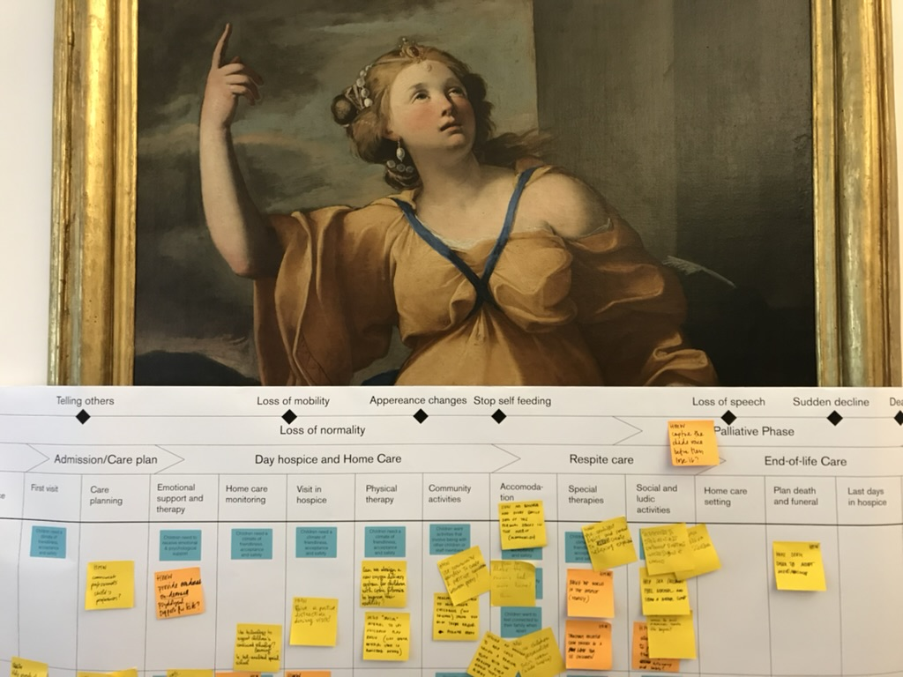

---
#
# By default, content added below the "---" mark will appear in the home page
# between the top bar and the list of recent posts.
# To change the home page layout, edit the _layouts/home.html file.
# See: https://jekyllrb.com/docs/themes/#overriding-theme-defaults
#
layout: default
title: home
---

## I am a design leader who helps people navigate complex health and care challenges, designing products and experiences grounded in connection and meaning, and built for lasting impact.

<link href="https://calendar.google.com/calendar/scheduling-button-script.css" rel="stylesheet">

### Explore my work 
- [Case studies](/work): Dive into recent design projects in health, care and innovation.
- [Writing](/writing): Read my published work on innovation, health and psychology.

### Discover Mortals
- Learn more about [Mortals](http://mortals.community) using awareness of mortality to help us live more fully.

### Speaking and events
- Watch my talk [*Design at the end*](https://vimeo.com/321016208) at IxDA.
- [Listen](https://www.youtube.com/watch?v=nVPdp9NtFcY) to my conversaton with writer and teacher, Stephen Jenkinson
- Looking for a speaker on design, health, or *death*? [Explore my past events](/talks) and book me for keynotes, workshops, or panels.
