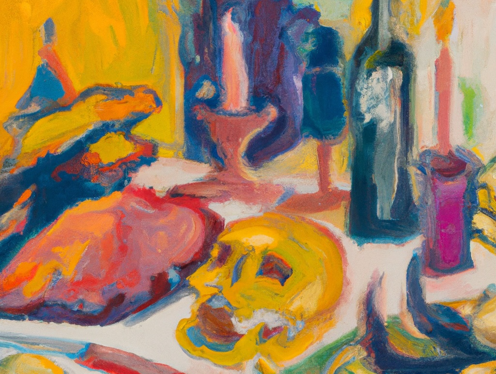

---
#
# By default, content added below the "---" mark will appear in the home page
# between the top bar and the list of recent posts.
# To change the home page layout, edit the _layouts/home.html file.
# See: https://jekyllrb.com/docs/themes/#overriding-theme-defaults
#
layout: home
---

I work at the intersection of design, health, and human experience. My journey has been driven by a deep-seated drive: to transform our relationship with mortality.

I’m committed to helping us awaken to our mortality, using design as a means to not only confront but harness this inevitable process. 

I want to help to us - both individually and collectively - embrace our mortality with understanding, dignity, and grace. I do that through designing, writing, talking and being with people. 

---

### Read 
- Read [case studies](/iw/work) of my recent design work
- Read some of my [published writing](/iw/writing) on innovation, health and psychology.

### Learn
- Learn more about my new venture [Mortals](http://mortals.community), an online community and group programme that is centred around awakening to life.

### Watch
- [Watch](https://vimeo.com/321016208) my talk "Design at the end" presented at IxDA
- [Listen](https://www.youtube.com/watch?v=nVPdp9NtFcY) to my conversaton with writer and teacher, Stephen Jenkinson

### Get in touch
- Hire me and lets [work together](/iw/design)
- Set up a [free consultation](/iw/eol) for end-of-life support
